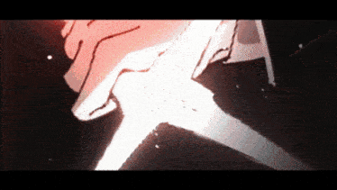

# Greetings. I'm Arfu (Full)

### 🔌 Embedded Hardware

*RMUTL · วิศวกรรมคอมพิวเตอร์*

*"Executioner sword" — inspired by Higuruma Hiromi*

## 🛠 Technical Skills

### 💻 Languages
C · C++ · Python

### 🔩 Hardware & PCB Tools
EasyEDA — 2/4-layer PCBs, differential pairs, ground planes

### 📡 Protocols & Platforms
UART / SPI / I2C · RS485 · Modbus · MQTT · BLE · Wi-Fi · ESP-NOW
ESP32 · STM32 · K230

### 🛠️ Development Tools
PlatformIO · Arduino · FreeRTOS · LVGL · VS Code · Git

## 🔥 Current Focus

- 💻 **Embedded Firmware Development** — Writing C/C++ for MCU-based systems
- ⚡ **RTOS Deep Dive** — FreeRTOS, Task Management, Mutex, Semaphore
- 📡 **Communication Protocols** — UART, SPI, I2C, CAN
- 🔗 **Wireless & BLE** — BLE Stack, GATT/GAP, Bluetooth Low Energy

## 🌙 Interests & Hobbies

- 😴 **Sleeping** — the most underrated hobby
- 📚 **Reading novels & manga** — mystery, strategy, plot twists, heartbreak, thriller

## 📫 Connect With Me

